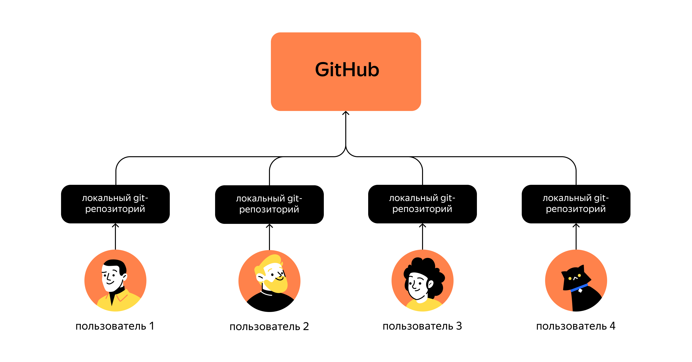
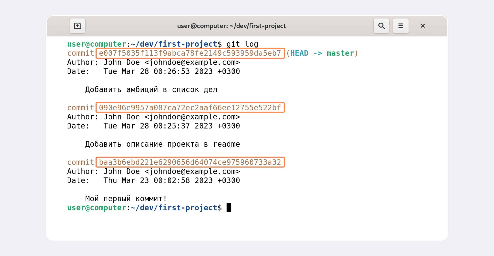
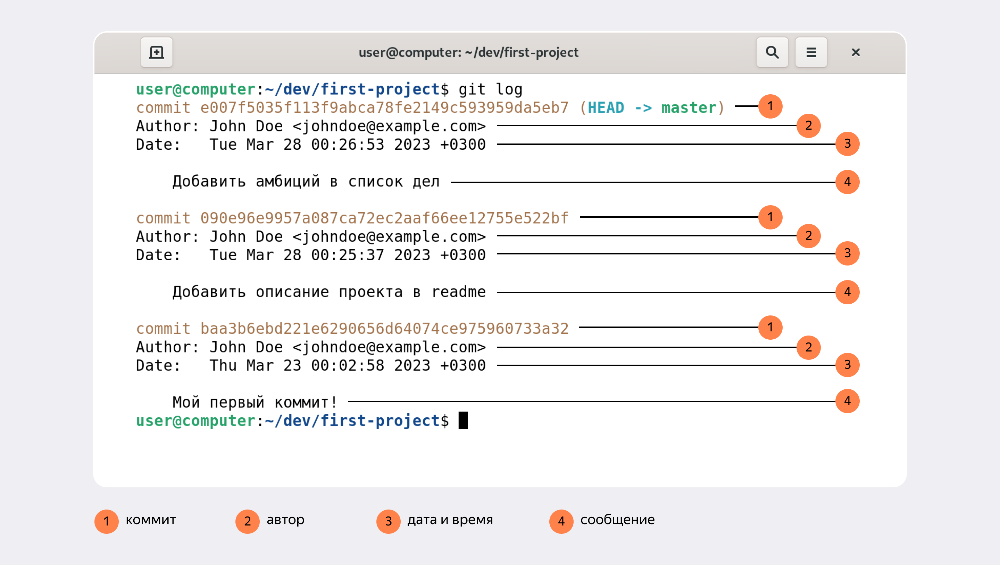
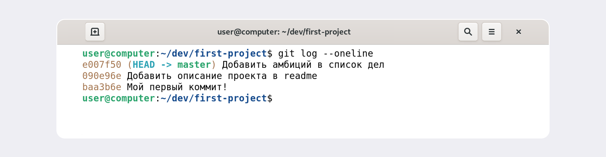

# Практическая работа №1. «Делимся проектом с миром»
### Автор: Шахназаров М.А. 27_qa-python###

# Знакомство с GitHub #

До этого момента вы использовали Git локально: сейчас проект `first-project` хранится только на вашем компьютере. Но одно из ключевых преимуществ Git — удобство командной работы над файлами. Чтобы поделиться репозиторием — например, с коллегами, — нужно завести его __удалённую версию.__ 

Процесс командной работы может выглядеть так: вы работаете над файлами проекта, например пишете код, на своём компьютере и сохраняете в локальном репозитории. Как только накапливается достаточно правок, чтобы поделиться ими с остальными, вы передаёте их на удалённый репозиторий. Там ваши коллеги смогут посмотреть то, что получилось, и даже скачать себе на компьютер.

Есть несколько платформ для такой командной работы. Самая популярная — __GitHub__. В нескольких следующих уроках покажем, как с ней работать. 

# Что такое GitHub #

[GitHub](https://www.google.com) — платформа для хранения IT-проектов и совместной работы над ними с использованием Git. По сути, это сайт, куда можно загрузить файлы своего проекта для обмена с другими людьми.

С английского языка слово __hub__ переводится как «узловая станция». И действительно, GitHub стал самым популярным сайтом для хранения Git-репозиториев. Многие крупные компании, такие как Google, Apple, Valve, используют GitHub для своих проектов. 

GitHub подходит, чтобы отточить навыки работы с Git. Здесь можно завести аккаунт и вместе со своей командой работать над любыми задачами. Можно создавать проекты разных типов: 
* приватный — только для вас;
* командный — только для членов команды;
* публичный — будет виден всем.

# Хеш — идентификатор коммита #

В процессе работы с Git вам будет часто встречаться понятие «хеш коммита». Эти странные строчки с бессмысленным (на первый взгляд) набором букв и цифр вы могли видеть, когда вызывали команду `git log` и выводили историю коммитов.

В этом уроке разберём, что такое хеши и зачем они нужны.

## Что такое хеш. Хеширование коммитов ##

__Хеширование__ (от англ. _hash_, «рубить», «крошить», «мешанина») — это способ преобразовать набор данных и получить их «отпечаток» (англ. fingerprint).

Информация о коммите — это набор данных: когда был сделан коммит, содержимое файлов в репозитории на момент коммита и ссылка на предыдущий, или __родительский__ (англ. _parent_), коммит.

Git хеширует (преобразует) информацию о коммите с помощью алгоритма __SHA-1__ (от англ. _Secure Hash Algorithm_ — «безопасный алгоритм хеширования») и получает для каждого коммита свой уникальный __хеш__ — результат хеширования.

Обычно хеш — это короткая (40 символов в случае SHA-1) строка, которая состоит из цифр 0—9 и латинских букв _A—F_ (неважно, заглавных или строчных). Она обладает следующими важными свойствами:

* если хеш получить дважды для одного и того же набора входных данных, то результат будет гарантированно одинаковый;
* если хоть что-то в исходных данных поменяется (хотя бы один символ), то хеш тоже изменится (причём сильно).

## Хеш — основной идентификатор коммита ##

Git хранит таблицу соответствий `хеш → информация о коммите`. Если вы знаете хеш, вы можете узнать всё остальное: автора и дату коммита и содержимое закоммиченных файлов. Можно сказать, что хеш — основной идентификатор коммита.

При работе с Git хеши будут встречаться вам регулярно. Их можно будет передавать в качестве параметра разным Git-командам, чтобы указать, с каким коммитом нужно произвести то или иное действие.

Все хеши и таблицу `хеш → информация о коммите` Git сохраняет в служебные файлы. Они находятся в скрытой папке .git в репозитории проекта.

# Исследуем лог #

В этом уроке рассмотрим подробнее, из каких элементов состоит описание коммита, а также как вывести сокращённый __лог__ (от англ. _log_ — «журнал [записей]»). Сокращённый лог полезен, если нужно быстро найти нужный коммит среди сотни других.

## Элементы описания коммита ##

После вызова `git log` появляется список коммитов.

Разберём элементы, из которых состоит описание:
* строка из цифр и латинских букв после слова commit — это хеш коммита;
* Author — имя автора и его электронная почта;
* Date — дата и время создания коммита;
* в конце находится сообщение коммита.

## Получить сокращённый лог — `git log --oneline`

Получить сокращённый лог можно с помощью команды `git log` с флагом `--oneline` (англ. «одной строкой»). В терминале появятся только первые несколько символов хеша каждого коммита и их комментарии.

Сокращённый лог полезен, если в репозитории уже много коммитов — например, сотни или тысячи. В этом случае можно быстро найти нужный по описанию.

Сокращённый хеш (то есть первые несколько символов полного) можно использовать точно так же, как и полный. Для этого команда `git log --oneline` автоматически подбирает такую длину сокращённых хешей, чтобы они были уникальными в пределах репозитория и Git всегда мог понять, о каком коммите идёт речь.

Обратите внимание: если выход из просмотра логов не произошёл автоматически, нажмите клавишу `Q` (от англ. _Quit_ — «выйти») в английской раскладке клавиатуры.

